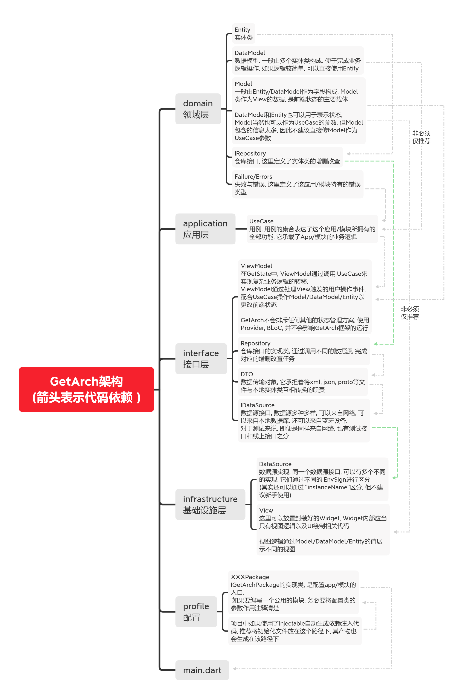

# get_arch_core

GetArch core package


## New Repo Address

**https://github.com/GetArch/get_arch_core**

## Getting Started

```dart
Future<void> main() async {
  WidgetsFlutterBinding.ensureInitialized();
  
  await GetArchApplication.run(
  EnvConfig(
    'Your App Name',
    'Lib Version / App Version',
    DateTime(2020, 6, 30),
    EnvSing.prod,
  ), 
  printConfig: !kReleaseMode, 
  packages: [ 
    // ... other GetArch package/ app ...
  ]);
  
  runApp(MyApp());
}
```

## Complete project structure

```text
lib
|-- domain
|   |-- entity ...
|   |-- data_model ...
|   |-- errors ...
|   '-- failures ...
|-- application
|   |-- usecase ...
|   '-- i_repo ...
|-- interfaces
|   |-- dto ...
|   |-- view_mdoel ...
|   |-- i_api ...
|   |-- i_data_source ...
|   '-- repo_impl ...
|-- infrastructure
|   |-- ui
|   |   |-- page ...
|   |   '-- view ...
|   |-- api_impl ...
|   '-- data_source_impl ...
|-- profile
|   |-- config_model.dart
|   |-- xxx_package.dart
|   '-- ...
'-- main.dart
```

## GetArch



## GetArch Universe


## 版本指南

以下内容仅针对使用 git依赖的项目

> 版本号规则:
>
> 基于 "语义版本号"进行适当修改制定
>
> - 注意:  仅包含1个分隔点的版本号代表某稳定版本的最新分支.
>   - 例如 v1.2 分支始终指向 v1.1.x版本, 其中, x代表最新版本, 如 v1.1.5为当前最新版本, 则 v1.2指向v1.1.5
> - 3位版本号含义: v主版本号.次版本号.修订号
>   - 主版本号 公共 API 出现重大变更时递增。
>   - 次版本号 在  API出现向不兼容的新功能出现时递增
>   - 修订号 在只做了向下兼容的修正时才递增。为了减少其他模块适配工作量, 这里的修正不仅指的针对不正确结果而进行的内部修改, 还包括不影响已有功能的新增修改
