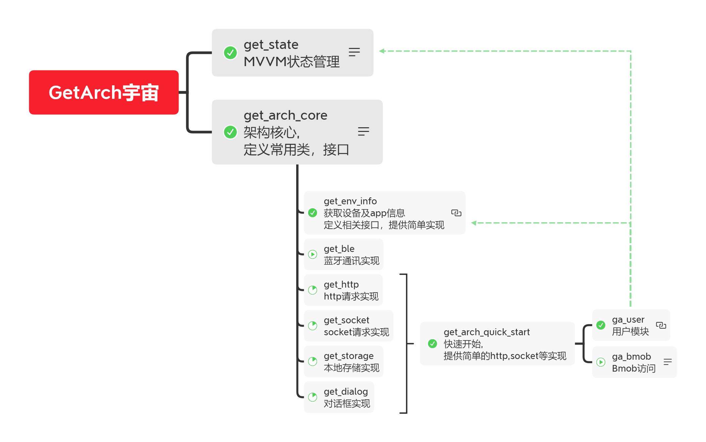

# get_arch_core

GetArch core package

## Getting Started
```dart
Future<void> main() async {
  WidgetsFlutterBinding.ensureInitialized();
  
  await GetArchApplication.run(
  EnvConfig(
    'Your App Name',
    'Lib Version / App Version',
    DateTime(2020, 6, 30),
    EnvSing.prod,
  ), 
  printConfig: !kReleaseMode, 
  packages: [ 
    // ... other GetArch package/ app ...
  ]);
  
  runApp(MyApp());
}
```

## GetArch Universe
