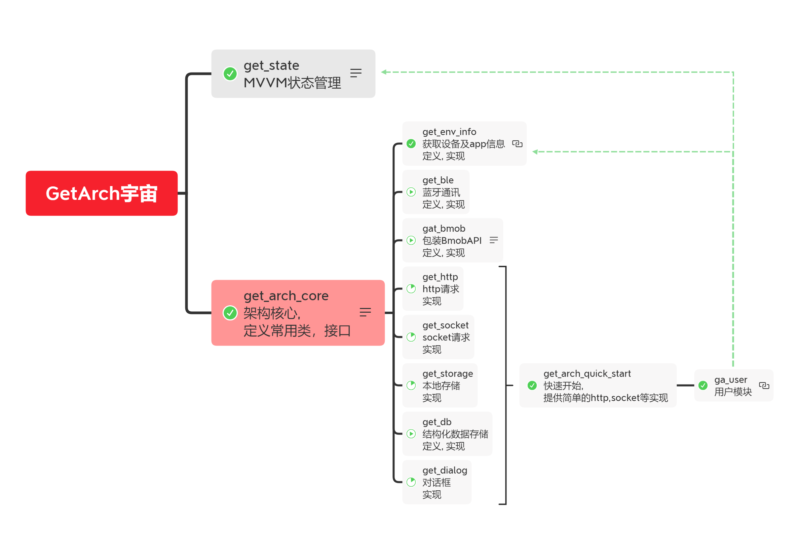

# get_arch_core

GetArch core package

## Getting Started

```dart
Future<void> main() async {
  WidgetsFlutterBinding.ensureInitialized();
  
  await GetArchApplication.run(
  EnvConfig(
    'Your App Name',
    'Lib Version / App Version',
    DateTime(2020, 6, 30),
    EnvSing.prod,
  ), 
  printConfig: !kReleaseMode, 
  packages: [ 
    // ... other GetArch package/ app ...
  ]);
  
  runApp(MyApp());
}
```

## Complete project structure:

```text
lib
|-- domain
|   |-- entity ...
|   |-- data_model ...
|   |-- errors ...
|   '-- failures ...
|-- application
|   |-- usecase ...
|   '-- i_repo ...
|-- interfaces
|   |-- dto ...
|   |-- view_mdoel ...
|   |-- i_api ...
|   |-- i_data_source ...
|   '-- repo_impl ...
|-- infrastructure
|   |-- ui
|   |   |-- page ...
|   |   '-- view ...
|   |-- api_impl ...
|   '-- data_source_impl ...
|-- profile
|   |-- config_model.dart
|   |-- xxx_package.dart
|   '-- ...
'-- main.dart
```

## GetArch


## GetArch Universe
